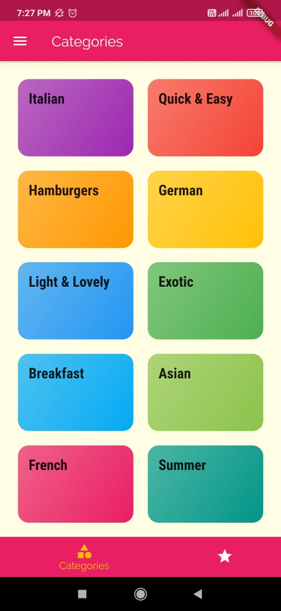
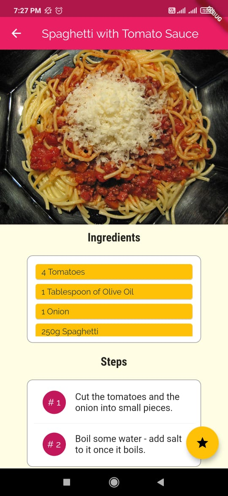
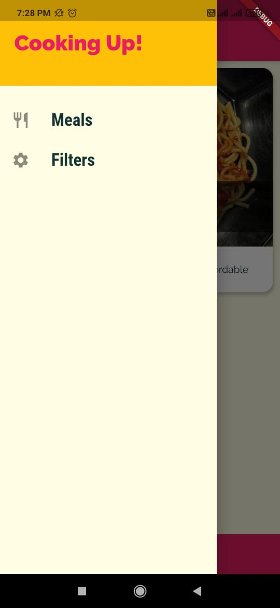
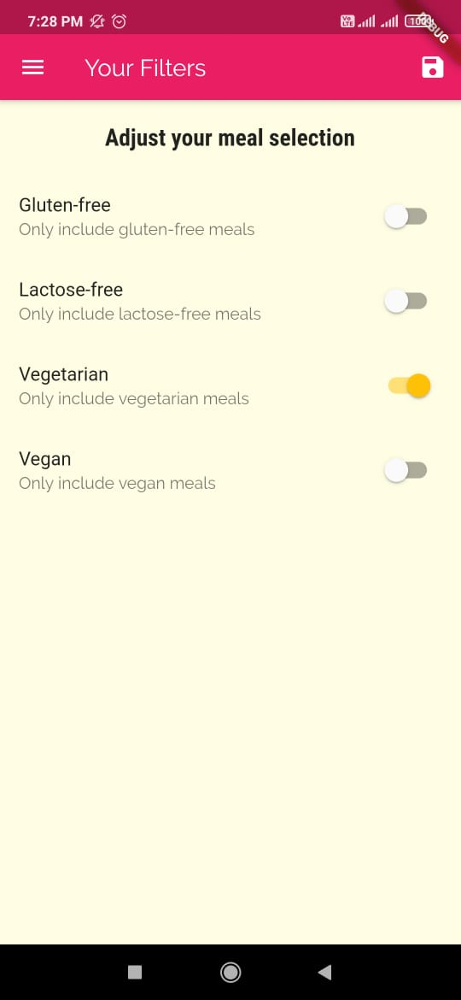

# Meals App
An app built using flutter which contains recipes on how to cook several dishes from different types of cuisines

### Installation and Setup

* Fork the repo and clone it.
```
https://github.com/AditiAgarwal17/meals_app.git
```
* In the same directory run the following commands(considering you have flutter installed and an android device connected)
```
flutter packages get
flutter run
```

### Preview

|  |  |
|:--------------------------|:--------------------------|
|  |  |
|  |  |
